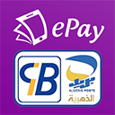

# Chargily For Developers

> No. 1 in e-payment services and solutions in Algeria.

### - Chargily Embraces Open Source

Chargily is committed to the notion that open source not only provides great technology for developers, but also brings the best out in people. 

### - Chargily believes in the following tenets:

1. Collaboration :
> Open source allows developers from around the world to proactively work together to achieve common goals.

2. Community :
> Open source provides opportunities for the creation of diverse communities in support of the betterment of everyone.

3. Technology :
> Open source has produced historic technologies, including operating systems, frameworks and programming languages.

### - Our APIs :

    

    

    

        
    

    

    

